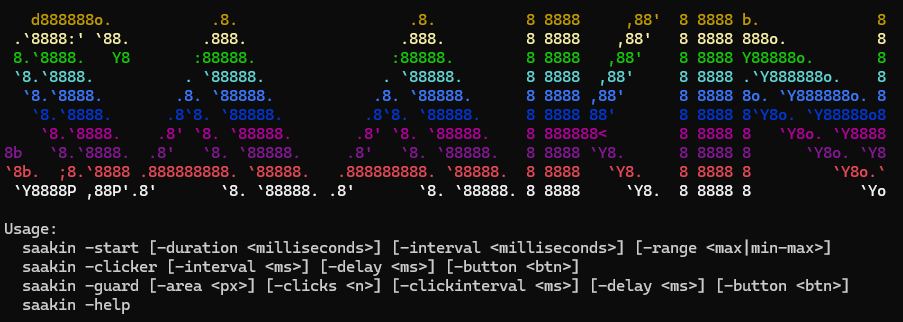

# Saakin

A Windows console utility for mouse automation featuring three powerful modes to prevent screen locking, automate clicks, and monitor screen regions for pixel changes.



## Features

- **Mouse Jitter** - Prevents screen savers and lock screens by randomly moving your cursor at configurable intervals
- **Auto-Clicker** - Automatically clicks at a locked position with configurable timing
- **Pixel Guard** - Monitors a screen region for changes and triggers clicks when pixels change

All modes include smart safety features that automatically pause when you move your mouse.

## Requirements

- Windows 7 or later
- .NET Framework 4.5.2 or later (pre-installed on Windows 10+)

## Installation

### Option 1: Build from Source

```bash
git clone https://github.com/yourusername/saakin.git
cd saakin
dotnet build -c Release
```

The executable will be in `bin/Release/saakin.exe`.

### Option 2: Download Release

Download the latest release from the [Releases](https://github.com/yourusername/saakin/releases) page and extract `saakin.exe`.

## Usage

### Display Help

```bash
saakin -help
```

### Mouse Jitter Mode

Prevents your screen from locking by moving the cursor randomly:

```bash
saakin -start [-duration <ms>] [-interval <ms>] [-range <max|min-max>]
```

**Options:**
- `-duration <ms>` - Total run time in milliseconds. If omitted, runs until stopped (Ctrl+C)
- `-interval <ms>` - Delay between jitters. Default: 1000 ms
- `-range <max|min-max>` - Jitter distance. Single value for max distance, or "min-max" for variable range. Default: 10-80 px

**Examples:**
```bash
# Run indefinitely with default settings
saakin -start

# Run for 1 hour, jitter every 500ms, within 50px range
saakin -start -duration 3600000 -interval 500 -range 50

# Run with variable range of 20-100px
saakin -start -range 20-100
```

**Behavior:**
- Moves cursor randomly at the specified interval
- Automatically pauses when you move the mouse manually
- Resumes after 10 seconds of mouse idle time
- Stop anytime with Ctrl+C

### Auto-Clicker Mode

Automatically clicks at a locked cursor position:

```bash
saakin -clicker [-interval <ms>] [-delay <ms>] [-button <btn>]
```

**Options:**
- `-interval <ms>` - Delay between clicks. Default: 1000 ms
- `-delay <ms>` - Initial delay before locking position. Default: 5000 ms
- `-button <btn>` - Mouse button to use: left, right, middle, x1, x2. Default: left

**Examples:**
```bash
# Click every second after 5 second delay
saakin -clicker

# Right-click every 500ms after 3 second delay
saakin -clicker -interval 500 -delay 3000 -button right
```

**Behavior:**
- Waits for the delay period, then locks onto current cursor position
- Continuously clicks at the locked position
- Stops immediately if you move the mouse

### Pixel Guard Mode

Monitors a screen region for pixel changes and triggers clicks:

```bash
saakin -guard [-area <px>] [-clicks <n>] [-clickinterval <ms>] [-delay <ms>] [-button <btn>]
```

**Options:**
- `-area <px>` - Size of square area to monitor (in pixels). Default: 50
- `-clicks <n>` - Number of clicks to perform when change detected. Default: 2
- `-clickinterval <ms>` - Delay between clicks. Default: 500 ms
- `-delay <ms>` - Initial delay before locking area. Default: 5000 ms
- `-button <btn>` - Mouse button to use: left, right, middle, x1, x2. Default: left

**Examples:**
```bash
# Monitor 50x50 area, double-click when change detected
saakin -guard

# Monitor 100x100 area, click 5 times when change detected
saakin -guard -area 100 -clicks 5 -clickinterval 200
```

**Behavior:**
- Waits for the delay period, then locks monitoring area centered on cursor
- Continuously compares current screen to baseline
- Performs specified number of clicks when pixel changes detected
- Stops if you move the mouse from the center position

## Common Use Cases

### Keep Computer Awake During Long Tasks

```bash
saakin -start -interval 30000
```

### AFK Farming in Games

```bash
saakin -clicker -interval 1000 -button left
```

### Monitor for Notifications/Alerts

```bash
saakin -guard -area 30 -clicks 1
```

### Prevent Screen Lock During Presentations

```bash
saakin -start -range 5
```

## Screenshots


## Building

See [CLAUDE.md](CLAUDE.md) for detailed build instructions.

Quick build:
```bash
dotnet build -c Release
```

## Contributing

Contributions are welcome! Please feel free to submit a Pull Request.

## License

This project is released under the MIT License - see [LICENSE](LICENSE) for details.

## Acknowledgments

- Built with C# and .NET Framework 4.5.2
- Uses Windows API via P/Invoke for mouse control
- Screen capture functionality via System.Drawing

## Disclaimer

This tool is for educational and legitimate automation purposes only. Use responsibly and in accordance with the terms of service of any software or games you use it with.
